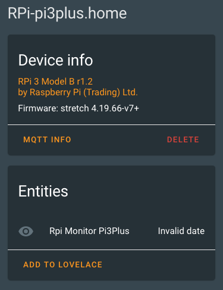

# RPi-Reporter-MQTT2HA-Daemon

![Project Maintenance][maintenance-shield]

[![GitHub Activity][commits-shield]][commits]

[](https://www.gnu.org/licenses/gpl-3.0)

[![GitHub Release][releases-shield]][releases]

A simple Linux python script to query the Raspberry Pi on which it is running for various configuration and status values which it then reports via via [MQTT](https://projects.eclipse.org/projects/iot.mosquitto) to your [Home Assistant](https://www.home-assistant.io/) installation.  This allows you to install and run this on each of your RPi's so you can track them all via your own Home Assistant Dashboard.



This script can alse be configured to be run in **daemon mode** continously in the background as a systemd service (or optionally as a script run from cron(1m).


## Features

* Tested on Raspberry Pi's 2/3/4 with Jessie, Stretch and Buster
* Tested with Home Assistant v0.111.0
* Tested with Mosquitto broker v5.1
* Data is published via MQTT
* MQTT discovery messages are sent so RPi's are automatically registered with Home Assistant (if MQTT discovery is enabled in your installation)
* MQTT authentication support
* No special/root privileges are required by this mechanism
* Linux daemon / systemd service, sd\_notify messages generated

### RPi Device

Each RPi device is reported as:

| Name            | Description |
|-----------------|-------------|
| `Manufacturer`   | Raspberry Pi (Trading) Ltd. |
| `Model`         | RPi 4 Model B v1.1  |
| `Name`      | (fqdn) pimon1.home |
| `sofware ver`  | OS Name, Version (e.g., Buster v4.19.75v7l+) |


### RPi Monitor

The monitored information is:

| Name            | Description |
|-----------------|-------------|
| `rpi_model`     | tinyfied hardware version string |
| `ifaces`        | comma sep list of interfaces on board [w,e,b] |
| `temperature_c `   | System temperature, in [°C] (0.1°C resolution) |
| `up_time`      | duration since last booted, as [days] |
| `last_update`  | updates last applied, as [date] |
| `fs_total_gb`       | total space in [GBytes] |
| `fs_free_prcnt`       | free space [%] |
| `host_name `       | hostname |
| `fqdn `       | hostname.domain |
| `ux_release `       | os release name (e.g., buster) |
| `ux_version `       | os version (e.g., 4.19.66-v7+) |
| `fs_free_prcnt`  | script name, version running on RPi |
| `ethernet`       |  |
|        | mac: 00:00:00:00:00:00  |
|        | eth0: 00.00.00.00 | 
| `wifi`       |  |
|        | mac: 00:00:00:00:00:00  |
|        | wlan0: 00.00.00.00 | 

## Prerequisites

An MQTT broker is needed as the counterpart for this daemon.

MQTT is huge help in connecting different parts of your smart home and setting up of a broker is quick and easy. In many cases you've already set one up when you installed Home Assistant.

## Installation

On a modern Linux system just a few steps are needed to get the daemon working.
The following example shows the installation under Debian/Raspbian below the `/opt` directory:

```shell
sudo apt-get install git python3 python3-pip

sudo git clone https://github.com/ironsheep/RPi-Reporter-MQTT2HA-Daemon.git /opt/ISP-RPi-mqtt-daemon

cd /opt/ISP-RPi-mqtt-daemon
sudo pip3 install -r requirements.txt
```
## Configuration

To match personal needs, all operational details can be configured by modifying entries within the file [`config.ini`](config.ini.dist).
The file needs to be created first:

```shell
cp /opt/ISP-RPi-mqtt-daemon/config.{ini.dist,ini}
vim /opt/ISP-RPi-mqtt-daemon/config.ini
```

## Execution

A first test run is as easy as:

```shell
python3 /opt/ISP-RPi-mqtt-daemon/ISP-RPi-mqtt-daemon.py
```

Using the command line argument `--config`, a directory where to read the config.ini file from can be specified, e.g.

```shell
python3 /opt/ISP-RPi-mqtt-daemon/ISP-RPi-mqtt-daemon.py --config /opt/ISP-RPi-mqtt-daemon
```


### Run as Daemon / Service

You probably want to execute this script **continuously in the background**.
This can be done by running it as a daemon. Or you can run this once at each time you want an update posted by runing the script from cron.

**NOTE:** Daemon mode must be enabled in the configuration file (default).

- via Systemd service - on systemd managed systems (the **recommended** option)

   ```shell
   sudo ln -s /opt/ISP-RPi-mqtt-daemon/isp-rpi-reporter.service /etc/systemd/system/isp-rpi-reporter.service

   sudo systemctl daemon-reload

   sudo systemctl start isp-rpi-reporter.service
   sudo systemctl status isp-rpi-reporter.service

   sudo systemctl enable isp-rpi-reporter.service
   ```
   
**NOTE:** Periodic (scheduled run once) mode must be enabled in your crontab

- via cron - You'll need to add a line to your crontab file as follows:

   (-- tba --)
   
## Integration

Data will be published to the (configurable) MQTT broker topic "`raspberrypi/{hostname}/...`" (e.g. `raspberrypi/picam01/...`).

An example:

```json
{
  "values": {
    "timestamp": "2020-07-18T00:11:56-06:00",
    "model": "RPi 3 Model B r1.2",
    "hostname": "pimon1",
    "fqdn": "pimon1.home",
    "linux_release": "stretch",
    "linux_version": "4.19.66-v7+",
    "uptime": "00:11:56 up 13 days",
    "update": "2007171607",
    "fs_space": "64GB",
    "fs_available": "10%",
    "temperature_c": "52.1",
    "reported_by": "ISP-RPi-mqtt-daemon.py v0.8.0"
  }
}
```

This data can be subscribed to and processed by your home assistant installation. How you build your RPi dashboard from here is up to you!  We are working on a new Lovelace Custom Card that will make displaying this RPi Monitor data very easy.  

*(Watch this space for news as we get closer to releasing the new card...)*

## Credits

Thank you to Thomas Dietrich for providing a wonderful pattern for this project. His project, which I use and heartily recommend, is [miflora-mqtt-deamon](https://github.com/ThomDietrich/miflora-mqtt-daemon)

----


## Disclaimer and Legal

> *Raspberry Pi* is registered trademark of *Raspberry Pi (Trading) Ltd.*
>
> This project is a community project not for commercial use.
> The authors will not be held responsible in the event of device failure or simply errant reporting of your RPi status.
>
> This project is in no way affiliated with, authorized, maintained, sponsored or endorsed by *Raspberry Pi (Trading) Ltd.* or any of its affiliates or subsidiaries.

----


### [Copyright](copyright) | [License](LICENSE)

[commits-shield]: https://img.shields.io/github/commit-activity/y/ironsheep/RPi-Reporter-MQTT2HA-Daemon.svg?style=for-the-badge
[commits]: https://github.com/ironsheep/RPi-Reporter-MQTT2HA-Daemon/commits/master

[license-shield]: https://img.shields.io/github/license/ironsheep/RPi-Reporter-MQTT2HA-Daemon.svg?style=for-the-badge

[maintenance-shield]: https://img.shields.io/badge/maintainer-S%20M%20Moraco%20%40ironsheepbiz-blue.svg?style=for-the-badge

[releases-shield]: https://img.shields.io/github/release/ironsheep/RPi-Reporter-MQTT2HA-Daemon.svg?style=for-the-badge
[releases]: https://github.com/ironsheep/RPi-Reporter-MQTT2HA-Daemon/releases

