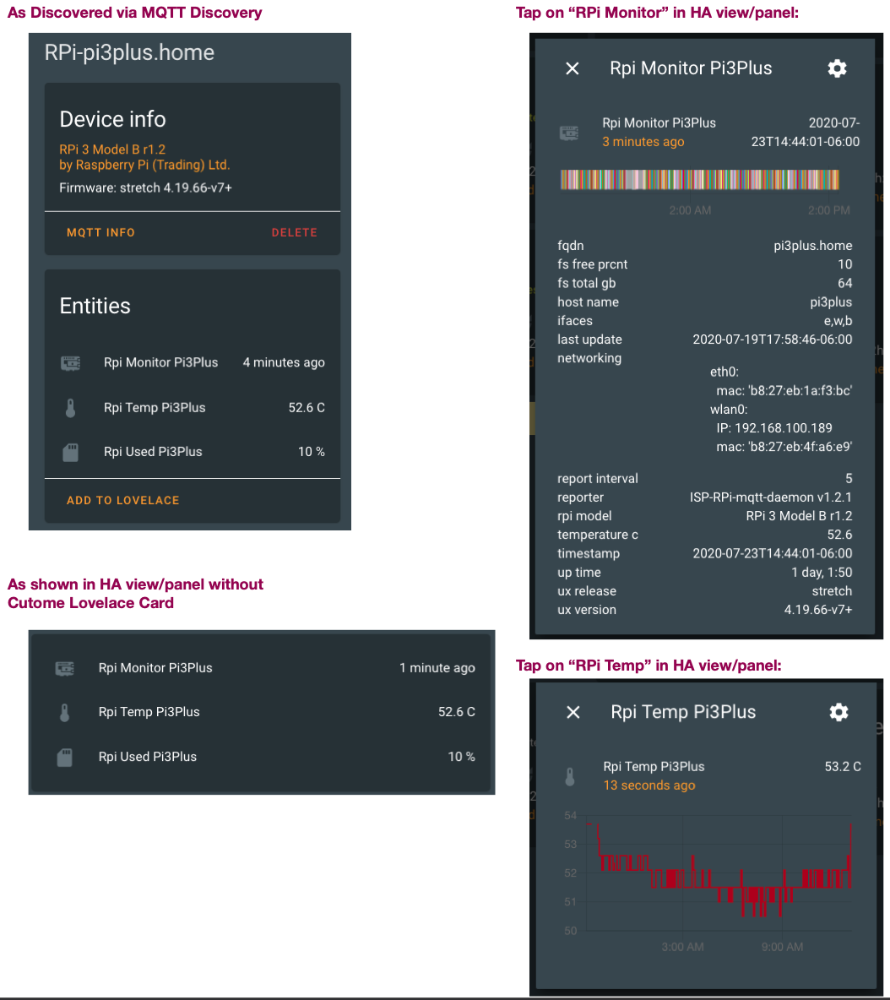

# RPi Reporter MQTT2HA Daemon

![Project Maintenance][maintenance-shield]

[![GitHub Activity][commits-shield]][commits]

[](https://www.gnu.org/licenses/gpl-3.0)

[![GitHub Release][releases-shield]][releases]

A simple Linux python script to query the Raspberry Pi on which it is running for various configuration and status values which it then reports via via [MQTT](https://projects.eclipse.org/projects/iot.mosquitto) to your [Home Assistant](https://www.home-assistant.io/) installation.  This allows you to install and run this on each of your RPi's so you can track them all via your own Home Assistant Dashboard.



This script can alse be configured to be run in **daemon mode** continously in the background as a systemd service (or optionally as a script run from cron(1m).

*(See below for links to associated Lovelace Custom Card.)*

## Features

* Tested on Raspberry Pi's 2/3/4 with Jessie, Stretch and Buster
* Tested with Home Assistant v0.111.0
* Tested with Mosquitto broker v5.1
* Data is published via MQTT
* MQTT discovery messages are sent so RPi's are automatically registered with Home Assistant (if MQTT discovery is enabled in your HA installation)
* MQTT authentication support
* No special/root privileges are required by this mechanism
* Linux daemon / systemd service, sd\_notify messages generated

### RPi Device

Each RPi device is reported as:

| Name            | Description |
|-----------------|-------------|
| `Manufacturer`   | Raspberry Pi (Trading) Ltd. |
| `Model`         | RPi 4 Model B v1.1  |
| `Name`      | (fqdn) pimon1.home |
| `sofware ver`  | OS Name, Version (e.g., Buster v4.19.75v7l+) |

### RPi MQTT Topics

Each RPi device is reported as three topics:

| Name            | Device Class | Units | Description
|-----------------|-------------|-------------|-------------|
| `~/monitor`   | 'timestamp' | n/a | Is a timestamp which shows when the RPi last sent information, carries a template payload conveying all monitored values (attach the lovelace custom card to this sensor!)
| `~/temperature`   | 'temperature' | degrees C | Shows the latest system temperature
| `~/disk_used`   | none | percent (%) | Shows the amount of root file system used

### RPi Monitor Topic

The monitored topic reports the following information:

| Name            | Description |
|-----------------|-------------|
| `rpi_model`     | tinyfied hardware version string |
| `ifaces`        | comma sep list of interfaces on board [w,e,b] |
| `temperature_c `   | System temperature, in [°C] (0.1°C resolution) |
| `up_time`      | duration since last booted, as [days] |
| `last_update`  | updates last applied, as [date] |
| `fs_total_gb`       | / total space in [GBytes] |
| `fs_free_prcnt`       | / free space [%] |
| `host_name `       | hostname |
| `fqdn `       | hostname.domain |
| `ux_release `       | os release name (e.g., buster) |
| `ux_version `       | os version (e.g., 4.19.66-v7+) |
| `reporter`  | script name, version running on RPi |
| `networking`       | lists for each interface: interface name, mac address (and IP if the interface is connected) |


## Prerequisites

An MQTT broker is needed as the counterpart for this daemon.

MQTT is huge help in connecting different parts of your smart home and setting up of a broker is quick and easy. In many cases you've already set one up when you installed Home Assistant.

## Installation

On a modern Linux system just a few steps are needed to get the daemon working.
The following example shows the installation under Debian/Raspbian below the `/opt` directory:

```shell
sudo apt-get install git python3 python3-pip python3-tzlocal python3-sdnotify python3-colorama

sudo git clone https://github.com/ironsheep/RPi-Reporter-MQTT2HA-Daemon.git /opt/RPi-Reporter-MQTT2HA-Daemon

cd /opt/RPi-Reporter-MQTT2HA-Daemon
sudo pip3 install -r requirements.txt
```
## Configuration

To match personal needs, all operational details can be configured by modifying entries within the file [`config.ini`](config.ini.dist).
The file needs to be created first:

```shell
cp /opt/RPi-Reporter-MQTT2HA-Daemon/config.{ini.dist,ini}
vim /opt/RPi-Reporter-MQTT2HA-Daemon/config.ini
```

You will likely want to locate and configure the following (at a minimum) in your config.ini:

```shell
# ...
hostname = {your-mqtt-broker}

# ...
base_topic = {your home-assistant base topic}

# ...
username = {your mqtt username if your setup requires one}
password = {your mqtt password if your setup requires one}

```

Now that your config.ini is setup let's test!

## Execution

### Initial Test

A first test run is as easy as:

```shell
python3 /opt/RPi-Reporter-MQTT2HA-Daemon/ISP-RPi-mqtt-daemon.py
```

**NOTE:** *it is a good idea to execute this script by hand this way each time you modify the config.ini.  By running after each modification the script can tell you through error messages if it had any problems with any values in the config.ini file, or any missing values. etc.*``

Using the command line argument `--config`, a directory where to read the config.ini file from can be specified, e.g.

```shell
python3 /opt/RPi-Reporter-MQTT2HA-Daemon/ISP-RPi-mqtt-daemon.py --config /opt/RPi-Reporter-MQTT2HA-Daemon
```

### Choose Run Style

You can choose to run this script as a system service or from cron(1m).

- Choose as a system service if you want your HA to know if your RPi is up/down as when run from a service HA knows if you RPi is online or not and when it last reported in.

- If, instead, you want the details of your RPi reported periodically to HA but don't care if it's up or down (or maybe you don't keep it up all the time) then run this script from cron(1m)

Let's look at how to set up each of these forms: 

#### Run as Daemon / Service

In order to have your HA system know if your RPi is online/offline and when it last reported in then you are setting up this script to run as a system service by following these steps:

**NOTE:** Daemon mode must be enabled in the configuration file (default).

By default the **isp-rpi-reporter.service** file indicates that the script should be run as user:group  **daemon:daemon**.  As this script requires access to the gpu you'll want to add access to them for the daemon user as follows:


   ```shell   
   # list current groups
   groups daemon 
   $ daemon : daemon

   # add video if not present
   sudo usermod daemon -a -G video
   
   # list current groups
   groups daemon
   $ daemon : daemon video
   #                 ^^^^^ now it is present
   ```

Now that the 'daemon' user is configured to allow access the hardware you can setup the script to be run as a system service as follows:

   ```shell
   sudo ln -s /opt/RPi-Reporter-MQTT2HA-Daemon/isp-rpi-reporter.service /etc/systemd/system/isp-rpi-reporter.service

   sudo systemctl daemon-reload

   sudo systemctl start isp-rpi-reporter.service
   sudo systemctl status isp-rpi-reporter.service

   # tell system that it can start our script at system startup during boot
   sudo systemctl enable isp-rpi-reporter.service
   ```
   
**NOTE:** *Please remember to run the 'systemctl enable ...' once at first install, if you want your script to start up everytime your RPi reboots!*

   
#### Run from Cron(1m)
   
In order to have the details of your RPi reported periodically to HA but not monitor your RPi for online/offline and when it reports in then we set up this script to run from cron(1m).

With the cron setup you can run this script at intervals during a day, one a day/week and/or every time the RPi is powered on (booted.)

   (-- tba --)
   
### Update to latest

Like most active developers, we periodically upgrade our script. You can update to the latest we've published by following these steps:

   ```shell
   # go to local repo
   cd /opt/RPi-Reporter-MQTT2HA-Daemon
   
   # stop the service
   sudo systemctl stop isp-rpi-reporter.service
   
   # get the latest version
   sudo git pull

	# reload the systemd configuration (in case it changed)
   sudo systemctl daemon-reload

	# restart the service with your new version
   sudo systemctl start isp-rpi-reporter.service
   
   # if you want, check status of the running script
   systemctl status isp-rpi-reporter.service

   ```
   
## Integration

When this script is running data will be published to the (configured) MQTT broker topic "`raspberrypi/{hostname}/...`" (e.g. `raspberrypi/picam01/...`).

An example:

```json
{
  "info": {
    "timestamp": "2020-07-19T13:17:54-06:00",
    "rpi_model": "RPi 3 Model B r1.2",
    "ifaces": "e,w,b",
    "host_name": "pi3plus",
    "fqdn": "pi3plus.home",
    "ux_release": "stretch",
    "ux_version": "4.19.66-v7+",
    "up_time": "13:17:54 up 14 days",
    "last_update": "2020-07-18T00:51:36-06:00",
    "fs_total_gb": 64,
    "fs_free_prcnt": 10,
    "networking": {
      "eth0": {
        "mac": "b8:27:eb:1a:f3:bc"
      },
      "wlan0": {
        "IP": "192.168.100.189",
        "mac": "b8:27:eb:4f:a6:e9"
      }
    },
    "temperature_c": 55.3,
    "reporter": "ISP-RPi-mqtt-daemon v0.8.5"
  }
}
```

**NOTE:** Where there's an IP address that interface is connected.

This data can be subscribed to and processed by your home assistant installation. How you build your RPi dashboard from here is up to you!  

## Lovelace Custom Card

We have a Lovelace Custom Card that makes displaying this RPi Monitor data very easy.  

See my project: [Lovelace RPi Monitor Card](https://github.com/ironsheep/lovelace-rpi-monitor-card)

## Credits

Thank you to Thomas Dietrich for providing a wonderful pattern for this project. His project, which I use and heartily recommend, is [miflora-mqtt-deamon](https://github.com/ThomDietrich/miflora-mqtt-daemon)

----


## Disclaimer and Legal

> *Raspberry Pi* is registered trademark of *Raspberry Pi (Trading) Ltd.*
>
> This project is a community project not for commercial use.
> The authors will not be held responsible in the event of device failure or simply errant reporting of your RPi status.
>
> This project is in no way affiliated with, authorized, maintained, sponsored or endorsed by *Raspberry Pi (Trading) Ltd.* or any of its affiliates or subsidiaries.

----


### [Copyright](copyright) | [License](LICENSE)

[commits-shield]: https://img.shields.io/github/commit-activity/y/ironsheep/RPi-Reporter-MQTT2HA-Daemon.svg?style=for-the-badge
[commits]: https://github.com/ironsheep/RPi-Reporter-MQTT2HA-Daemon/commits/master

[license-shield]: https://img.shields.io/github/license/ironsheep/RPi-Reporter-MQTT2HA-Daemon.svg?style=for-the-badge

[maintenance-shield]: https://img.shields.io/badge/maintainer-S%20M%20Moraco%20%40ironsheepbiz-blue.svg?style=for-the-badge

[releases-shield]: https://img.shields.io/github/release/ironsheep/RPi-Reporter-MQTT2HA-Daemon.svg?style=for-the-badge
[releases]: https://github.com/ironsheep/RPi-Reporter-MQTT2HA-Daemon/releases

