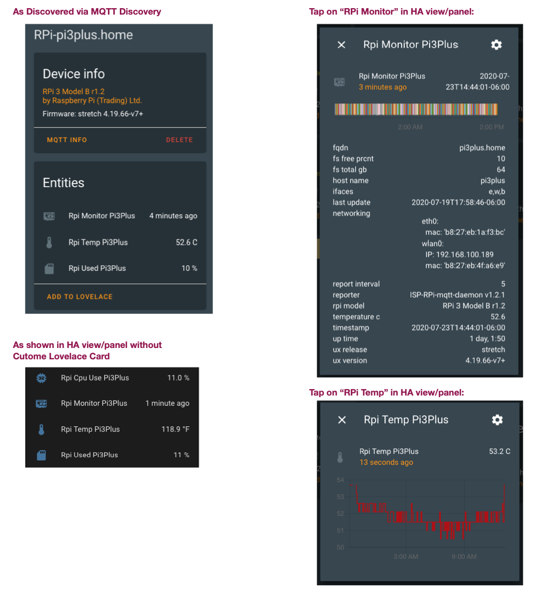

# RPi Reporter MQTT2HA Daemon

![Project Maintenance][maintenance-shield]

[![GitHub Activity][commits-shield]][commits]

[](https://www.gnu.org/licenses/gpl-3.0)

[![GitHub Release][releases-shield]][releases]

A simple Linux python script to query the Raspberry Pi on which it is running for various configuration and status values which it then reports via via [MQTT](https://projects.eclipse.org/projects/iot.mosquitto) to your [Home Assistant](https://www.home-assistant.io/) installation. This allows you to install and run this on each of your RPi's so you can track them all via your own Home Assistant Dashboard.



This script should be configured to be run in **daemon mode** continously in the background as a systemd service (or optionally as a SysV init script). Instructions are provided below.

_(Jump to below [Lovelace Custom Card](#lovelace-custom-card).)_

## Script Updates

We've been repairing this script as users report issues with it. For a list of fixes for each release see our [ChangeLog](./ChangeLog)

---

If you like my work and/or this has helped you in some way then feel free to help me out for a couple of :coffee:'s or :pizza: slices!

[](https://www.buymeacoffee.com/ironsheep)

---

## Features

- Tested on Raspberry Pi's 2/3/4 with Jessie, Stretch and Buster
- Tested with Home Assistant v0.111.0 -> 2021.11.5
- Tested with Mosquitto broker v5.1 - v6.0.1
- Data is published via MQTT
- MQTT discovery messages are sent so RPi's are automatically registered with Home Assistant (if MQTT discovery is enabled in your HA installation)
- MQTT authentication support
- No special/root privileges are required by this mechanism
- Linux daemon / systemd service, sd_notify messages generated

### RPi Device

Each RPi device is reported as:

| Name           | Description                                  |
| -------------- | -------------------------------------------- |
| `Manufacturer` | Raspberry Pi (Trading) Ltd.                  |
| `Model`        | RPi 4 Model B v1.1                           |
| `Name`         | (fqdn) pimon1.home                           |
| `sofware ver`  | OS Name, Version (e.g., Buster v4.19.75v7l+) |

### RPi MQTT Topics

Each RPi device is reported as four topics:

| Name            | Device Class  | Units       | Description                                                                                                                                                                    |
| --------------- | ------------- | ----------- | ------------------------------------------------------------------------------------------------------------------------------------------------------------------------------ |
| `~/monitor`     | 'timestamp'   | n/a         | Is a timestamp which shows when the RPi last sent information, carries a template payload conveying all monitored values (**attach the lovelace custom card to this sensor!**) |
| `~/temperature` | 'temperature' | degrees C   | Shows the latest system temperature                                                                                                                                            |
| `~/disk_used`   | none          | percent (%) | Shows the amount of root file system used                                                                                                                                      |
| `~/cpu_load`    | none          | percent (%) | Shows CPU load % over the last 5 minutes                                                                                                                                       |

### RPi Monitor Topic

The monitored topic reports the following information:

| Name                | Sub-name           | Description                                                                                         |
| ------------------- | ------------------ | --------------------------------------------------------------------------------------------------- |
| `rpi_model`         |                    | tinyfied hardware version string                                                                    |
| `ifaces`            |                    | comma sep list of interfaces on board [w,e,b]                                                       |
| `temperature_c`     |                    | System temperature, in [°C] (0.1°C resolution) Note: this is GPU temp. if available, else CPU temp. |
| `temp_gpu_c`        |                    | GPU temperature, in [°C] (0.1°C resolution)                                                         |
| `temp_cpu_c`        |                    | CPU temperature, in [°C] (0.1°C resolution)                                                         |
| `up_time`           |                    | duration since last booted, as [days]                                                               |
| `last_update`       |                    | updates last applied, as [date]                                                                     |
| `fs_total_gb`       |                    | / total space in [GBytes]                                                                           |
| `fs_free_prcnt`     |                    | / free space [%]                                                                                    |
| `host_name`         |                    | hostname                                                                                            |
| `fqdn`              |                    | hostname.domain                                                                                     |
| `ux_release`        |                    | os release name (e.g., buster)                                                                      |
| `ux_version`        |                    | os version (e.g., 4.19.66-v7+)                                                                      |
| `reporter`          |                    | script name, version running on RPi                                                                 |
| `networking`        |                    | lists for each interface: interface name, mac address (and IP if the interface is connected)        |
| `drives`            |                    | lists for each drive mounted: size in GB, % used, device and mount point                            |
| `cpu`               |                    | lists the model of cpu, number of cores, etc.                                                       |
|                     | `hardware`         | typically the Broadcom chip ID (e.g. BCM2835)                                                       |
|                     | `model`            | model description string (e.g., ARMv7 Processor rev 4 (v7l))                                        |
|                     | `number_cores`     | number of cpu cores [1,4]                                                                           |
|                     | `bogo_mips`        | reported performance of this RPi                                                                    |
|                     | `serial`           | serial number of this RPi                                                                           |
|                     | `load_1min_prcnt`  | average % cpu load during prior minute (avg per core)                                               |
|                     | `load_5min_prcnt`  | average % cpu load during prior 5 minutes (avg per core)                                            |
|                     | `load_15min_prcnt` | average % cpu load during prior 15 minutes (avg per core)                                           |
| `memory`            |                    | shows the total amount of RAM in MB and the available ram in MB                                     |
| `reporter`          |                    | name and version of the script reporting these values                                               |
| `reporter_releases` |                    | list of latest reporter formal versions                                                             |
| `report_interval`   |                    | interval in minutes between reports from this script                                                |
| `throttle`          |                    | reports the throttle status value plus interpretation thereof                                       |
| `timestamp`         |                    | date, time when this report was generated                                                           |

_NOTE: cpu load averages are divided by the number of cores_

## Prerequisites

An MQTT broker is needed as the counterpart for this daemon.

MQTT is huge help in connecting different parts of your smart home and setting up of a broker is quick and easy. In many cases you've already set one up when you installed Home Assistant.

## Installation

On a modern Linux system just a few steps are needed to get the daemon working.
The following example shows the installation under Debian/Raspbian below the `/opt` directory:

First install extra packages the script needs (select one of the two following commands)

### Packages for Ubuntu, Raspberry pi OS, and the like

```shell
sudo apt-get install git python3 python3-pip python3-tzlocal python3-sdnotify python3-colorama python3-unidecode python3-paho-mqtt
```

### Packages for pure Ubuntu

**NOTE** if you are running a **pure Ubuntu** not Raspberry pi OS then you may need to install additional packages to get the binary we use to get the core temperatures and tools to inspec the network interfaces. (_If you are NOT seeing temperatures in your Lovelace RPI Monitor Card this is likely the cause. Or if some of your RPis don't show up in Home Assistant_) Do the following in this case:

```shell
sudo apt-get install libraspberrypi-bin net-tools
```

### Packages for Arch Linux

```shell
sudo pacman -S python python-pip python-tzlocal python-notify2 python-colorama python-unidecode python-paho-mqtt inetutils
```

### Now finish with the script install

Now that the extra packages are installed let's install our script and any remaining supporting python modules.

```shell
sudo git clone https://github.com/ironsheep/RPi-Reporter-MQTT2HA-Daemon.git /opt/RPi-Reporter-MQTT2HA-Daemon

cd /opt/RPi-Reporter-MQTT2HA-Daemon
sudo pip3 install -r requirements.txt
```

**WARNING:** If you choose to install these files in a location other than `/opt/RPi-Reporter-MQTT2HA-Daemon`, you will need to modify some of the control files which are used when setting up to run this script automatically. The following files:

- **rpi-reporter** - Sys V init script
- **isp-rpi-reporter.service** - Systemd Daemon / Service description file

... need to have any mention of `/opt/RPi-Reporter-MQTT2HA-Daemon` changed to your install location **before you can run this script as a service.**

## Configuration

To match personal needs, all operational details can be configured by modifying entries within the file [`config.ini`](config.ini.dist).
The file needs to be created first: (_in the following: if you don't have vim installed you might try nano_)

```shell
sudo cp /opt/RPi-Reporter-MQTT2HA-Daemon/config.{ini.dist,ini}
sudo vim /opt/RPi-Reporter-MQTT2HA-Daemon/config.ini
```

You will likely want to locate and configure the following (at a minimum) in your config.ini:

```shell
fallback_domain = {if you have older RPis that dont report their fqdn correctly}
# ...
hostname = {your-mqtt-broker}
# ...
discovery_prefix = {if you use something other than 'homeassistant'}
# ...
base_topic = {your home-assistant base topic}

# ...
username = {your mqtt username if your setup requires one}
password = {your mqtt password if your setup requires one}

```

Now that your config.ini is setup let's test!

## Execution

### Initial Test

A first test run is as easy as:

```shell
python3 /opt/RPi-Reporter-MQTT2HA-Daemon/ISP-RPi-mqtt-daemon.py
```

**NOTE:** _it is a good idea to execute this script by hand this way each time you modify the config.ini. By running after each modification the script can tell you through error messages if it had any problems with any values in the config.ini file, or any missing values. etc._``

Using the command line argument `--config`, a directory where to read the config.ini file from can be specified, e.g.

```shell
python3 /opt/RPi-Reporter-MQTT2HA-Daemon/ISP-RPi-mqtt-daemon.py --config /opt/RPi-Reporter-MQTT2HA-Daemon
```

### Preparing to run full time

In order to have your HA system know if your RPi is online/offline and when it last reported-in then you must set up this script to run as a system service.

**NOTE:** Daemon mode must be enabled in the configuration file (default).

But first, we need to grant access to some hardware for the user account under which the sevice will run.

### Set up daemon account to allow access to temperature values

By default this script is run as user:group **daemon:daemon**. As this script requires access to the GPU you'll want to add access to it for the daemon user as follows:

```shell
# list current groups
groups daemon
$ daemon : daemon

# add video if not present
sudo usermod daemon -a -G video

# list current groups
groups daemon
$ daemon : daemon video
#                 ^^^^^ now it is present
```

### Choose Run Style

You can choose to run this script as a `systemd service` or as a `Sys V init script`. If you are on a newer OS than `Jessie` or if as a system admin you are just more comfortable with Sys V init scripts then you can use the latter style.

Let's look at how to set up each of these forms:

#### Run as Systemd Daemon / Service (_for Raspian/Raspberry pi OS newer than 'jessie'_)

(**Heads Up** _We've learned the hard way that RPi's running `jessie` won't restart the script on reboot if setup this way, Please set up these RPi's using the init script form shown in the next section._)

Set up the script to be run as a system service as follows:

```shell
sudo ln -s /opt/RPi-Reporter-MQTT2HA-Daemon/isp-rpi-reporter.service /etc/systemd/system/isp-rpi-reporter.service

sudo systemctl daemon-reload

# tell system that it can start our script at system startup during boot
sudo systemctl enable isp-rpi-reporter.service

# start the script running
sudo systemctl start isp-rpi-reporter.service

# check to make sure all is ok with the start up
sudo systemctl status isp-rpi-reporter.service
```

**NOTE:** _Please remember to run the 'systemctl enable ...' once at first install, if you want your script to start up every time your RPi reboots!_

#### Run as Sys V init script (_your RPi is running 'jessie' or you just like this form_)

In this form our wrapper script located in the /etc/init.d directory and is run according to symbolic links in the `/etc/rc.x` directories.

Set up the script to be run as a Sys V init script as follows:

```shell
sudo ln -s /opt/RPi-Reporter-MQTT2HA-Daemon/rpi-reporter /etc/init.d/rpi-reporter

# configure system to start this script at boot time
sudo update-rc.d rpi-reporter defaults

# let's start the script now, too so we don't have to reboot
sudo /etc/init.d/rpi-reporter start

# check to make sure all is ok with the start up
sudo /etc/init.d/rpi-reporter status
```

### Update to latest

Like most active developers, we periodically upgrade our script. Use one of the following list of update steps based upon how you are set up.

#### Systemd commands to perform update

If you are setup in the systemd form, you can update to the latest we've published by following these steps:

```shell
# go to local repo
cd /opt/RPi-Reporter-MQTT2HA-Daemon

# stop the service
sudo systemctl stop isp-rpi-reporter.service

# get the latest version
sudo git pull

# reload the systemd configuration (in case it changed)
sudo systemctl daemon-reload

# restart the service with your new version
sudo systemctl start isp-rpi-reporter.service

# if you want, check status of the running script
systemctl status isp-rpi-reporter.service

```

#### SysV init script commands to perform update

If you are setup in the Sys V init script form, you can update to the latest we've published by following these steps:

```shell
# go to local repo
cd /opt/RPi-Reporter-MQTT2HA-Daemon

# stop the service
sudo /etc/init.d/rpi-reporter stop

# get the latest version
sudo git pull

# restart the service with your new version
sudo /etc/init.d/rpi-reporter start

# if you want, check status of the running script
sudo /etc/init.d/rpi-reporter status

```

## Integration

When this script is running data will be published to the (configured) MQTT broker topic "`raspberrypi/{hostname}/...`" (e.g. `raspberrypi/picam01/...`).

An example:

```json
{
  "info": {
    "timestamp": "2021-12-02T17:45:48-07:00",
    "rpi_model": "RPi 3 Model B r1.2",
    "ifaces": "e,w,b",
    "host_name": "pibtle",
    "fqdn": "pibtle.home",
    "ux_release": "stretch",
    "ux_version": "4.19.66-v7+",
    "up_time": "46 days,  23:14",
    "last_update": "2021-11-30T18:29:45-07:00",
    "fs_total_gb": 32,
    "fs_free_prcnt": 41,
    "networking": {
      "eth0": {
        "IP": "192.168.100.81",
        "mac": "b8:27:eb:d1:16:42"
      },
      "wlan0": {
        "mac": "b8:27:eb:84:43:17"
      }
    },
    "drives": {
      "root": {
        "size_gb": 32,
        "used_prcnt": 41,
        "device": "/dev/root",
        "mount_pt": "/"
      }
    },
    "memory": {
      "size_mb": "926.078",
      "free_mb": "215.750"
    },
    "cpu": {
      "hardware": "BCM2835",
      "model": "ARMv7 Processor rev 4 (v7l)",
      "number_cores": 4,
      "bogo_mips": "307.20",
      "serial": "00000000a8d11642",
      "load_1min_prcnt": 23.2,
      "load_5min_prcnt": 22.5,
      "load_15min_prcnt": 22.8
    },
    "throttle": ["throttled = 0x0", "Not throttled"],
    "temperature_c": 63.4,
    "temp_gpu_c": 63.4,
    "temp_cpu_c": 62.8,
    "reporter": "ISP-RPi-mqtt-daemon v1.6.0",
    "report_interval": 5
  }
}
```

**NOTE:** Where there's an IP address that interface is connected.

This data can be subscribed to and processed by your home assistant installation. How you build your RPi dashboard from here is up to you!

## Lovelace Custom Card

We have a Lovelace Custom Card that makes displaying this RPi Monitor data very easy.

See my project: [Lovelace RPi Monitor Card](https://github.com/ironsheep/lovelace-rpi-monitor-card)

## Troubleshooting

### Issue: Some of my RPi's don't show up in HA

Most often fix: _install the missing package._

We occasionaly have reports of users with more than one RPi on their network but only one shows up in Home Assistant. This is most often caused when this script generats a non-unique id for the RPi's. This in turn is most often caused by an inability to get network interface details. I've just updated the install to ensure that we have net-tools package installed. On Raspberry Pi OS this package is already present while on Ubuntu this is not installed by default. If you can successfully run ifconfig(8) then you have what's needed. If not then simply run `sudo apt-get install net-tools`.

### General debug

The deamon script can be run my hand while enabling debug and verbose messaging:

```shell
python3 /opt/RPi-Reporter-MQTT2HA-Daemon/ISP-RPi-mqtt-daemon.py -d -v
```

This let's you inspect many of the values the script is going to use and to see the data being sent to the MQTT broker.

## Contributors

This project is enjoyed by users in many countries. A number of these users have taken the time so submit pull requests which contribute changes/fixes to this project.

Thank you to the following github users for taking the time to help make this project function better for all of us!:

- [dflvunoooooo](https://github.com/dflvunoooooo)
- [woodmj74](https://github.com/woodmj74)
- [Henry-Sir](https://github.com/Henry-Sir)

## Credits

Thank you to Thomas Dietrich for providing a wonderful pattern for this project. His project, which I use and heartily recommend, is [miflora-mqtt-deamon](https://github.com/ThomDietrich/miflora-mqtt-daemon)

Thanks to [synoniem](https://github.com/synoniem) for working through the issues with startup as a SystemV init script and for providing 'rpi-reporter' script itself and for identifying the need for support of other boot device forms.

---

## Disclaimer and Legal

> _Raspberry Pi_ is registered trademark of _Raspberry Pi (Trading) Ltd._
>
> This project is a community project not for commercial use.
> The authors will not be held responsible in the event of device failure or simply errant reporting of your RPi status.
>
> This project is in no way affiliated with, authorized, maintained, sponsored or endorsed by _Raspberry Pi (Trading) Ltd._ or any of its affiliates or subsidiaries.

---

### [Copyright](copyright) | [License](LICENSE)

[commits-shield]: https://img.shields.io/github/commit-activity/y/ironsheep/RPi-Reporter-MQTT2HA-Daemon.svg?style=for-the-badge
[commits]: https://github.com/ironsheep/RPi-Reporter-MQTT2HA-Daemon/commits/master
[maintenance-shield]: https://img.shields.io/badge/maintainer-stephen%40ironsheep.biz-blue.svg?style=for-the-badge
[releases-shield]: https://img.shields.io/github/release/ironsheep/RPi-Reporter-MQTT2HA-Daemon.svg?style=for-the-badge
[releases]: https://github.com/ironsheep/RPi-Reporter-MQTT2HA-Daemon/releases
