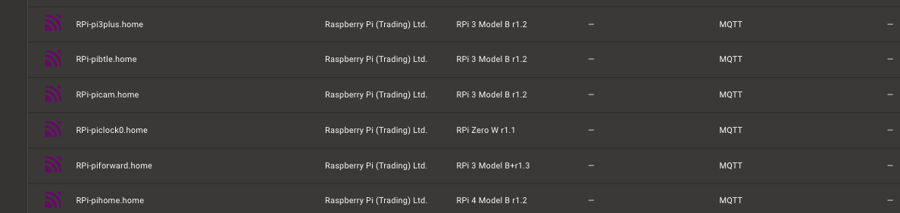
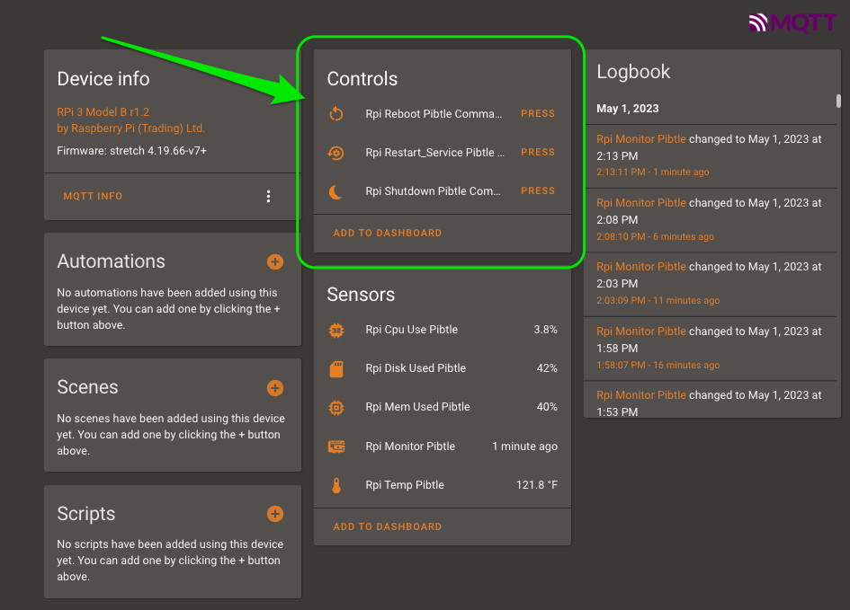

# Setting up RPi Control from Home Assistant

![Project Maintenance][maintenance-shield]

[![GitHub Activity][commits-shield]][commits]

[](https://www.gnu.org/licenses/gpl-3.0)

[![GitHub Release][releases-shield]][releases]

## RPi Reporter MQTT2HA Daemon

The RPi Reporter Daemon is a simple Linux python script which queries the Raspberry Pi on which it is running for various configuration and status values which it then reports via via [MQTT](https://projects.eclipse.org/projects/iot.mosquitto) to your [Home Assistant](https://www.home-assistant.io/) installation. 

This page describes how to enable control features over your RPi which would allow you to shutdown or reboot your RPi from within Home Assistant.  Enabling this feature allows you to add buttons to your RPi display in HA (e.g., press a button to reboot your RPi) and it also activates the MQTT listening features so that the RPi can hear the request and run the associated script (e.g., reboot)

In order for this to work you need to make a few adjustments on each RPi you wish to control:

- Enable optional settings in your `config.ini`
- Add permissions to run each command for the user underwhich the Daemon script runs
- Add a card on Home Assistant which displays the control button

This page will walk you through each of these steps.

## Table of Contents

On this Page:

- [Updates to MQTT Interface](#mqtt-interface-when-commanding-is-enabled) - shows what changes when the commanding interface is exposed
- [Script Configuration](#configuring-the-daemon) - configuring the Daemon to offer the commanding interface
- [Permissions Configuration](#enabling-the-daemon-to-run-external-commands) - allow the Daemon to run the new commands
- [Add initial card to HA]() - create your first button in Home Assistant allowing you to reboot your RPi

Additional pages:

- [Overall Daemon Instructions](/README.md) - This project top level README
- [The Associated Lovelace RPi Monitor Card](https://github.com/ironsheep/lovelace-rpi-monitor-card) - This is our companion Custom Lovelace Card that makes displaying this RPi Monitor data very easy.
- [ChangeLog](./ChangeLog) - We've been repairing or adding features to this script as users report issues or wishes. This is our list of changes.

## MQTT Interface when commanding is enabled

### RPi Device

The Daemon already reports each RPi device as:

| Name           | Description                                  |
| -------------- | -------------------------------------------- |
| `Manufacturer` | Raspberry Pi (Trading) Ltd.                  |
| `Model`        | RPi 4 Model B v1.1                           |
| `Name`         | (fqdn) pimon1.home                           |
| `sofware ver`  | OS Name, Version (e.g., Buster v4.19.75v7l+) |

### RPi MQTT Topics

The Daemon also reports five topics for each RPi device:

| Name            | Device Class  | Units       | Description                                                                                                                                                                    |
| --------------- | ------------- | ----------- | ------------------------------------------------------------------------------------------------------------------------------------------------------------------------------ |
| `~/monitor`     | 'timestamp'   | n/a         | Is a timestamp which shows when the RPi last sent information, carries a template payload conveying all monitored values (**attach the lovelace custom card to this sensor!**) |
| `~/temperature` | 'temperature' | degrees C   | Shows the latest system temperature                                                                                                                                            |
| `~/disk_used`   | none          | percent (%) | Shows the percent of root file system used                                                                                                                                     |
| `~/cpu_load`    | none          | percent (%) | Shows CPU load % over the last 5 minutes                                                                                                                                       |
| `~/mem_used`    | none          | percent (%) | Shows the percent of RAM used                                                                                                                                                  |

### RPi MQTT Command Topics

Once the commanding is enabled then the Daemon also reports the commanding interface for the RPi. By default we've provided examples for enabling three commands (See `config.ini.dist`.) This is what the commanding interface looks like when all three are enabled:

| Name            | Device Class  |  Description                                                                                                                                                                    |
| --------------- |  ----------- | ------------------------------------------------------------------------------------------------------------------------------------------------------------------------------ |
| `~/shutdown` | button |  Send request to this endpoint to shut the RPi down                                                                                                                                          |
| `~/reboot`   | button          | Send request to this endpoint to reboot the RPi                                                                                                                                    |
| `~/restart_service`    | button          |  Send request to this endpoint to restart the Daemon service          

The new content in `config.ini.dist` should look like something like this: 

```shell
[Commands]
#shutdown = /usr/bin/sudo /sbin/shutdown -h now 'shutdown rqst via MQTT'
#reboot = /usr/bin/sudo /sbin/shutdown -r now 'reboot rqst via MQTT'
#restart_service = /usr/bin/sudo systemctl restart isp-rpi-reporter.service
```
                                             
## Configuring the Daemon

By adding commands you'd like to initiate remotely to your configuration file `config.ini` you will then be able to execute these commands on the monitored Raspberry Pis using MQTT, meaning yes, from buttons in your Home Assistant interface!

After adding the comamnds to your `config.ini`, you then need to accomplish a couple more steps to activate these commands.  Here is the overall list of 4 steps \[S1-S4\]  we need to take:

- S1: Place commands you wish to use into your `config.ini`
- S2: Verify the path to each command you are going to use
    - Ensure the command paths are correct in the newly copied lines in your `config.ini'
- S3: Enable the `Daemon` user to run these commands (by modifying the [sudo(8)](https://linux.die.net/man/8/sudo) config file. See: [sudoers(5)](https://linux.die.net/man/5/sudoers))
- S4: Ensure our monitor script has the correct ownership so the daemon can run it and so sudo can verify it as a valid script to run commands.

**NOTE:** *Every time you want to add another command, you will need to repeat these steps for the new command.*

### S1: Add new configuration options

Copy this new `[Commands]` section from the `config.ini.dist` (which we provide for reference) to your `config.ini` and then uncomment the commands you wish to activate (by removing the leading '#' character on each line).

In the following we've enabled all three commands  which now gives us commands to reboot, shutdown, or restart the RPi reporting service on the Pi:

```shell
[Commands]
shutdown = /usr/bin/sudo /sbin/shutdown -h now 'shutdown rqst via MQTT'
reboot = /usr/bin/sudo /sbin/shutdown -r now 'reboot rqst via MQTT'
restart_service = /usr/bin/sudo systemctl restart isp-rpi-reporter.service
```

*NOTE* the message in the `{action} rqst via MQTT` message (shutdown or reboot) is logged in `/var/log/auth.log` so one can keep track of when commands are executed via MQTT.
  
### S2: Verify absolute path to each command you use

By default we want to keep our RPi security very tight. To that end, we actually specify absolute paths for commands that we want the Daemon to be able to execute.

In some systems the path for `systemctl` / `reboot` / `shutdown` can be different.  Make sure the path you specify is correct for your system.

You can do a quick check of what the actual path is by using the `type` command:

```bash
$ type systemctl shutdown
systemctl is /usr/bin/systemctl
shutdown is /usr/sbin/shutdown
```

Ensure that the new lines you added to your `config.ini` use exactly these full paths.

**NOTE:** *We use absolute paths so that user scripts or other commands can't be substituted for the executables we expect to be run. (If these alternates happened to be in the search path and were found before the ones we want then the alternate commands would be run by our script.  The effect of this happening can range from nothing happening to seriously malicious things happening. So we just avoid the possibility by using absolute paths in this way.)*

### S3: Enabling the Daemon to run external commands

Again, by default, we want to keep our RPi security very tight. To that end, we actually specify each command that we want the Daemon to be able to execute.  We do this my making changes to the sudo(8) control file `/etc/sudoers`

The "daemon" user we use to start the daemon in the installation instructions doesn't have enough privileges to reboot or power down the computer. The workaround we'll use is to give permissions to daemon to be able to run the commands we want to execute using the sudoers configuration file.  There is an older and a newer way to do this.  Here are both ways #1, and #2 (choose #1 if the directory is present):

#### Alternate #1: The /etc/sudoers.d/ directory is present

On my newer systems there is an `/etc/sudoers.d/` directory.  In that directory I create a new file numbering it so it is read later in the loading effort.  I use the name `020_daemon` for this file.

*NOTE: in the following you MUST replace `<raspberrypihostname>` with the name of your RPi. So in the case of my RPi with a hostname of `rpibtle.home` I replace `<raspberrypihostname>` with `rpibtle`*

  ```shell
  # edit sudoers file
  sudo visudo -f /etc/sudoers.d/020_daemon
  
  # add the following lines to the empty file:
  
  # note that every service that we want to allow to restart must be specified here
  daemon <raspberrypihostname> =NOPASSWD: /usr/bin/systemctl restart isp-rpi-reporter.service,/sbin/shutdown
  ```
  
**NOTE:** *We use visudo(8) so that we are not locked out of our system if we leave an error in our sudoers file! This is VERY IMPORTANT, please be careful. If yhou do get into trouble refer to [How to restore a broken sudoers file without being able to use sudo](https://unix.stackexchange.com/questions/677591/how-to-restore-a-broken-sudoers-file-without-being-able-to-use-sudo) to get things working again.*

#### Alternate #2: No /etc/sudoers.d/ directory found

When the directory is not found then we, instead, add our new content to the existing control file by placing it at the end of the file (after all existing content):

*NOTE: in the following you MUST replace `<raspberrypihostname>` with the name of your RPi. So in the case of my RPi with a hostname of `rpibtle.home` I replace `<raspberrypihostname>` with `rpibtle`*

  ```shell
  # edit sudoers file
  sudo visudo
  
  # add the following lines at the bottom of the file
  
  # note that every service that we want to allow to restart must be specified here
  daemon <raspberrypihostname> =NOPASSWD: /usr/bin/systemctl restart isp-rpi-reporter.service,/sbin/shutdown
  ```
  
**NOTE:** *We use visudo(8) so that we are not locked out of our system if we leave an error in our sudoers file! This is VERY IMPORTANT, please be careful. If yhou do get into trouble refer to [How to restore a broken sudoers file without being able to use sudo](https://unix.stackexchange.com/questions/677591/how-to-restore-a-broken-sudoers-file-without-being-able-to-use-sudo) to get things working again.*

### S4: Adjusting the ownership of our reporter script

Additionally, the daemon user needs permission to execute the shell script referenced in the run-script command (and any command referenced there/access to the directories specified). If the script has been created by the standard pi user, a simple workaround is:

```shell
sudo chown daemon RPi-mqtt-daemon-script.sh
```

## Verifying your configuration

After getting this configured you'll want to verify that everying is configured correctly.  I recommend the following 4 steps \[V1-V4\] (it's what I do...):

- V1: Restart the daemon
    - Use a tool like [MQTT Explorer](http://mqtt-explorer.com/) to verifiy that the new MQTT command interface appeared
- V2: Use HA's device page to test your new commands
- V3: Ensure the action occurred, if you were logged in did you see a 'wall message'?
- V4: Verify taht the action appeared in the logs

Let's go into a bit more detail for some of these steps.

### V1: Restart the daemon

You'll need to restart the Daemon or reboot the RPi to get your changes to take effect.
Then you'll want to see if the new control interface is exposed.  I check out what's appearing in MQTT by using a tool like [MQTT Explorer](http://mqtt-explorer.com/).

### V2: Use the card built by Home Assistant Discovery to test your new controls

In your Home Assistant Interface navigate to: Settings->Devices & Services->Devices and scroll to the device that represents your RPi just configured.

You should see somthing like this:


Next click on the device that is your RPi. I'll click on RPi-pibtle.home in this list.

You should now see something like this:


The green arrow (above) points out the control interface that device discovery created for you.


### V3: Ensure the action occurred

Next I pressed the reboot button on the new interface. I was logged into the RPi at the time so when the reboot occurred it kicked me off which told me it was working well.

### V4: Verify that the message appeared in the logs

Lastly I wanted to ensure the action was logged so I did a simple grep for "via" in the `/var/log/auth.log` file and sure enough there was the entry.

With this finding i've verified that this is all working for me!
(*now you can do the same!*)

## Want to go further? Build a custom HA RPi Control card

Refer to the [Lovelace RPi Monitor Card](https://github.com/ironsheep/lovelace-rpi-monitor-card) page for details but there is a [specific example button card](https://github.com/ironsheep/lovelace-rpi-monitor-card#example-control-of-your-rpi-avail-in-daemon-v180-and-later)

This was originally built by copying the card suggested by looking at the RPi Device as discovered by home assistant.  In that display it shows an example interface card and allows you to copy the suggestion to your clipboard.  I then pasted this card into the page yaml where I wanted the card to be shown. I then overrode the names with simple more direct names than the default button names.  That's it. It just worked.

---

> If you like my work and/or this has helped you in some way then feel free to help me out for a couple of :coffee:'s or :pizza: slices!
>
> [](https://www.buymeacoffee.com/ironsheep) &nbsp;&nbsp; -OR- &nbsp;&nbsp; [](https://www.patreon.com/IronSheep?fan_landing=true)[Patreon.com/IronSheep](https://www.patreon.com/IronSheep?fan_landing=true)

---


## Disclaimer and Legal

> _Raspberry Pi_ is registered trademark of _Raspberry Pi (Trading) Ltd._
>
> This project is a community project not for commercial use.
> The authors will not be held responsible in the event of device failure or simply errant reporting of your RPi status.
>
> This project is in no way affiliated with, authorized, maintained, sponsored or endorsed by _Raspberry Pi (Trading) Ltd._ or any of its affiliates or subsidiaries.

---

### [Copyright](copyright) | [License](LICENSE)

[commits-shield]: https://img.shields.io/github/commit-activity/y/ironsheep/RPi-Reporter-MQTT2HA-Daemon.svg?style=for-the-badge
[commits]: https://github.com/ironsheep/RPi-Reporter-MQTT2HA-Daemon/commits/master
[maintenance-shield]: https://img.shields.io/badge/maintainer-stephen%40ironsheep.biz-blue.svg?style=for-the-badge
[releases-shield]: https://img.shields.io/github/release/ironsheep/RPi-Reporter-MQTT2HA-Daemon.svg?style=for-the-badge
[releases]: https://github.com/ironsheep/RPi-Reporter-MQTT2HA-Daemon/releases
